 <!DOCTYPE html>
<html>
<head>
<title></title>
</head>
<body>

<h1>Spelling Challange Game</h1>
 

 

Welcome to Spelling Challange! Spelling Challenge was built for children between 8 – 11 to test their long vocabulary skills. This game was constructed using only python. Spelling Challenge allows kids to guess a letter of a random word. Each word is ten letters long. Because this is a game based around learning to spell, a player gets to have 7 wrong guesses during a single game. If they guess the word before running out of chances, they win! If not, they can restart the game and try again. It’s all about the effort!

<a href="https://spelling-challange.herokuapp.com/">Link to live Spelling Challange Game</a> 

<h2><u>Features</u></h2>
 
<b>Welcome</b>
 
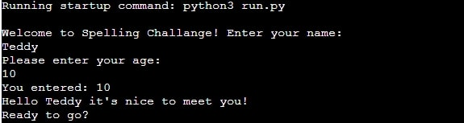
 

The welcome feature welcomes the player to the game, asked for their name and greets the user by their name.

 
<b>Enter Age</b>
 
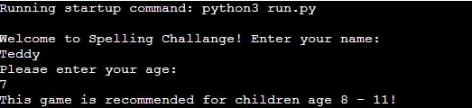
 

The age feature asks the player their age, if they are between 8-11, the game proceeds. If they are not between 8-11, the terminal prints the game's age recommendation.

 
<b>Correct/Incorrect</b>
 
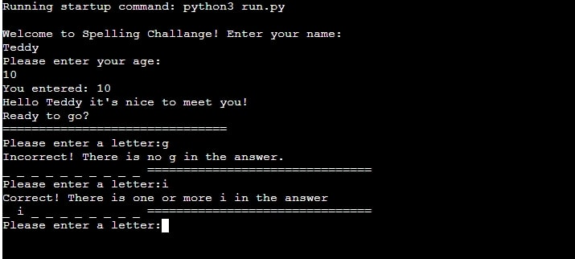
 

The Correct/Incorrect tells the player if their guess was correct or incorrect. If correct, their guess is added to a list in the terminal

 

<h2><u>Design</u></h2>

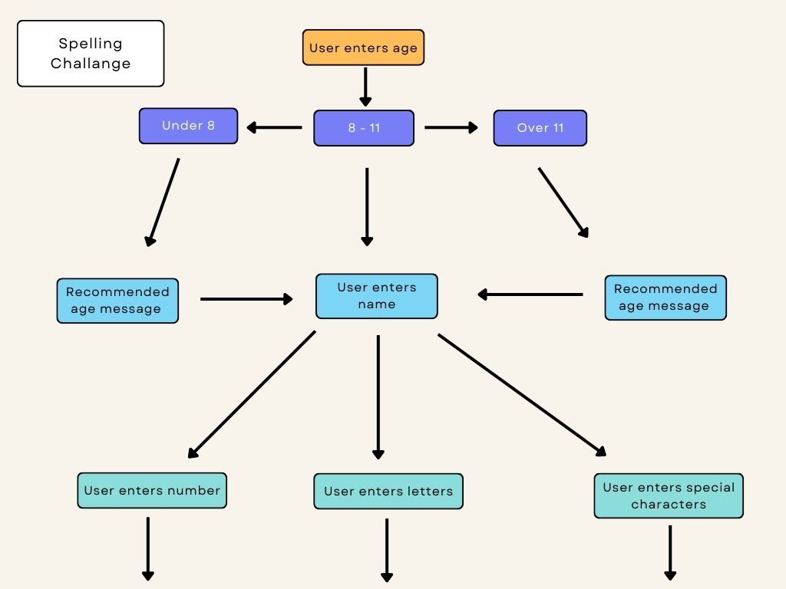

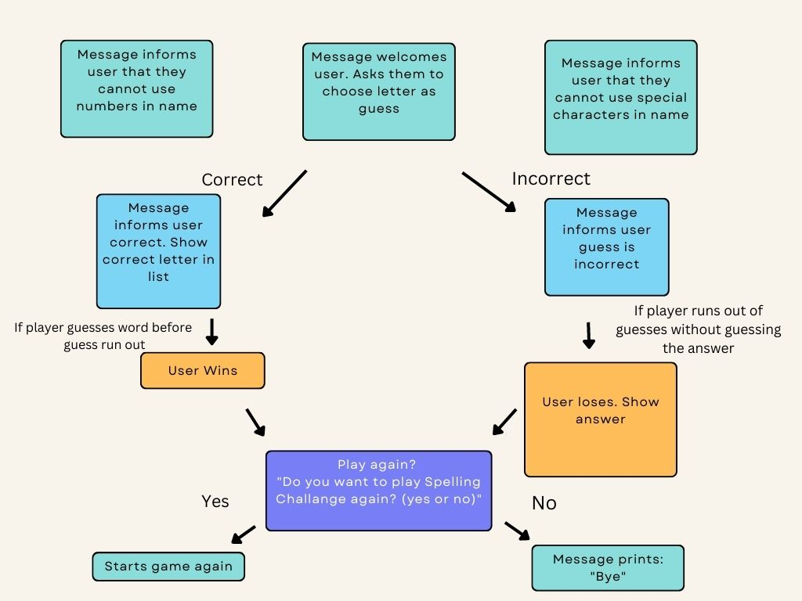

<h2><u>Technologies</u></h2>
 
<b>Lanuages:</b>

This could was created using only python

 
<b>Tools and resouces:</b>

Gitpod, Github, Heroku, README.md template, Canva, Stack Overflow

<h2><u>Testing</u></h2>

<h2><u>Bugs</u></h2>
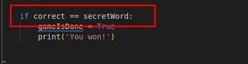
 
 
<b>Issue:</b>
 

In order for the ‘Spelling Challenge’ to successfully work, the player’s guesses must be added and then compared to the answer (SecretWord). This code was not working as testing proved that a bug was stopping the player’s score from being compared to the answer. 

 
<b>Resolution:</b>
 

The solution came along with the realisation that the current code was comparing a string to a list. Once the len() method was implemented on both the ‘correct’ list and the ‘secretWord’ string, the two could be successfully compared.

 
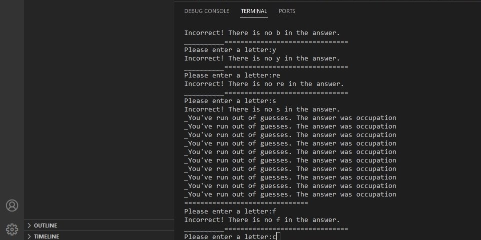
 
 
<b>Issue:</b>
 

I discovered a bug in my code that resulted in print statements being printed multiple times in the terminal. This bug was attached to the code in the while loop that checks if the player’s guesses matches the answer. 

 
<b>Resolution:</b>
 

I resolved this bug by researching online. I eventually found some information of Stack Overflow on the nature of while loops.The bug was caused by the loop repeating because it didn’t have a break. I inserted two breaks into the while loop and the issue was resolved.

 
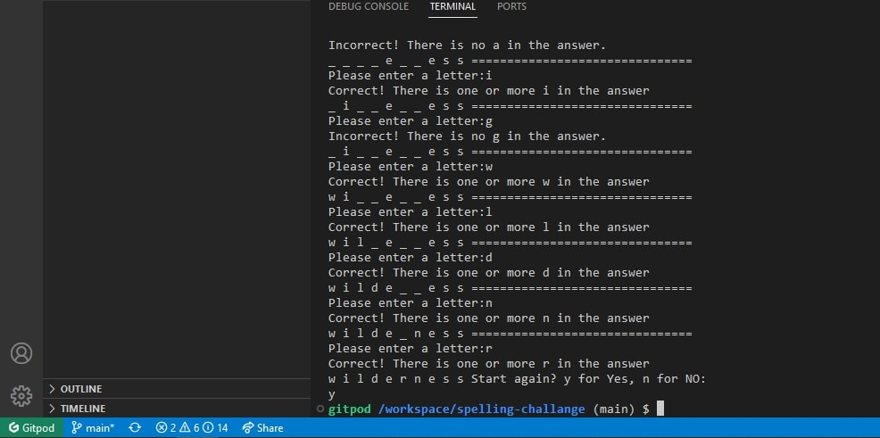
 
 
<b>Issue:</b>
 

I previously had code in place at the bottom of my 'while fail_Count >:0' code to restart the game (play_Again) when the player click ‘y’ for yes. The issue was that I didn’t work. The player could click on ‘y’ but it wouldn’t restart the game. Instead, the guesses from the player’s last game would carry over, leaving them with very little (if any) guesses to try and solve the game. 

 

Original code:

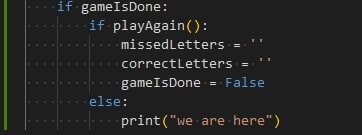
 
 
<b>Resolution:</b>
 

I went to tutor support for help investigating the issue. The tutor pointed out that part of the issue was that the ‘correct’ and ‘incorrect’ lists were not emptying when the game the game ended, because of this, the guesses from the last game were still counted. I added ‘correct = []’ and ‘incorrect = [ ]’ to the end of the restart function to reset the lists. That solved part of the issue. In the end, I opted to add a main() function to all the game code so it would restart when ‘y’ was selected by the player. 

 
 
<b>Issue:</b>
 

Spelling Challange required the user to take 10 guesses. This caused an issue if the player would win because it meant the player would have to enter ten guesses to win, so they would have to keep pressing 'enter' until the 'You Win' print message appeared

 
 
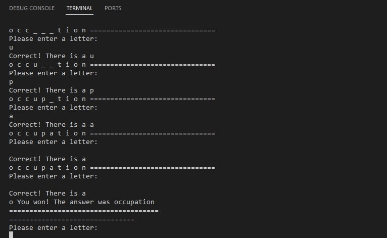
 
 
<b>Resolution:</b>
 

I went on tutor support for help. My tutor Ger explained that another list would have to be created from the string of the secret word and checked against the correct answers, then the lengths could be.

 
<h2><u>Unresolved Bugs</u></h2>
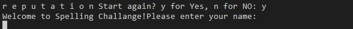
 
 
<b>Issue:</b>
 

The list created from the string of the secretWord is called 'test answer'. The name of the list prints to the terminal. I tried changing the name and it broke that snippet of code.I have left it as it is in hopes that I can return to it when the course it finished.

 
<h2><u>Credits</u></h2>

The structure of this code was inspired by code from www.inventwithpython.com

<a href = "https://inventwithpython.com/invent4thed/chapter8.html">'Chapter 8 - Writing the Hangman code'</a> 
 

The code for the second while loop was inspired by CBT Nuggets on Youtube

<a href = "https://www.youtube.com/watch?v=JNXmCOumNw0&t=9s">'How to Build a Hangman Game with Python'</a> 
 

The code for the def main() function is from MrLauLearning on YouTube

<a href = "https://www.youtube.com/watch?v=SZdQX4gbql0&t=175s">'Looping your code back to the beginning using a procedure'</a> 
 

<h2><u>Deployment</u></h2>

<h2><u>Acknowledgments</u><h2>

This is a paragraph.

</body>
</html> 

